# Heart Disease Analysis
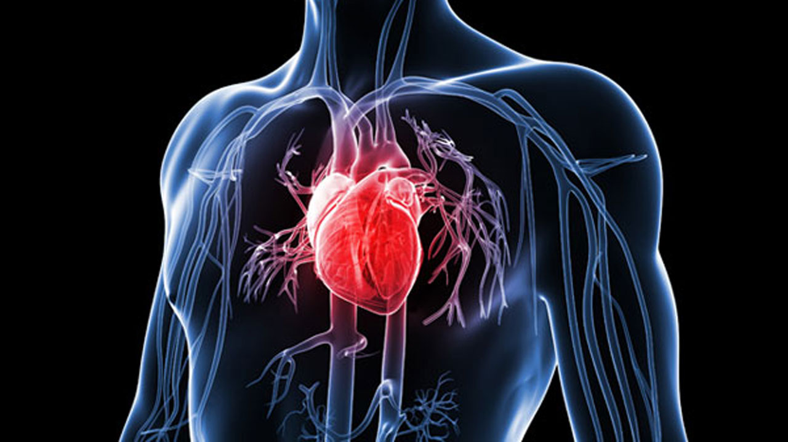 
## Project Description: 
Cardiovascular diseases (CVDs) also known as heart diseases is a critical medical conditions with various contributing factors that impact their occurrence. heart diseases are the leading cause of death globally taking an estimated 17.9 million lives each year.  This project aims to analyze the relationships between potential factors and the occurrence of heart failure using **_Linear Regression Analysis_**. By leveraging statistical techniques, we seek to uncover significant associations between independent variables and likelihood of heart failure. 

## Objectives 
Understanding the factors that increase the risk of having cardiovascular disease is now more crucial than ever due to the large percentage of it in the death rate.
-	Identify key factors that may contribute to the occurrence of heart failure 
-	Provide insights into the relative importance of different factors in predicting heart failure

## Description of the data sources used in the project. 
The dataset contains information on various features of heart disease, and is titled "Heart Disease Prediction Dataset". It was collected and made available on Kaggle.
Brief overview of the dataset:
-	Number of observations: 270 
-	Number of variables: 14
-	File type: CSV (Comma Separated Values)
The variables in the dataset are:
      1. age       
      2. sex (0 = Female, 1 = Male)      
      3. chest pain type (4 values)  
      4. Resting blood pressure  
      5. serum cholesterol in mg/dl      
      6. fasting blood sugar > 120 mg/dl       
      7. Resting electrocardiographic results (values 0,1,2) 
      8. Maximum heart rate achieved  
      9. Exercise-induced angina    
      10. old peak = ST depression induced by exercise relative to rest   
      11. ST segment: the slope of the peak exercise 
      12. Number of major vessels (0-3) colored by fluoroscopy        
      13. Thal: 3 = normal; 6 = fixed defect; 7 = reversible defect  
     14. Heart disease (1 = absence, 2 = presence)

## Approach:
-	Light exploration of the dataset. 
-	Data Cleaning which included removing blank cells and duplicate values. 
-	Used Pivot tables, data analysis tools for regression, and functions. 
-	A visual description of the data was obtained using graphical representation techniques.

###  How does the presence or absence of heart disease vary across different ages?
   
Create a pivot table that shows the age range in the dataset with their corresponding heart disease scores (present/absent).

Visual Relationship of the Age with the Heart Disease

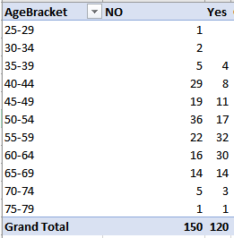                    |   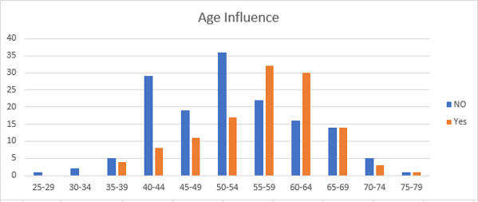

**INSIGHT:**  The presence of heart disease tends to increase as age increases and has its highest impact on the age group of 55-59, this can be through lots of anxiety.

### Relationship between Sex with the presence and absence of heart disease?
   
Create a pivot table that shows the sex range in the dataset with their corresponding heart disease scores (present/absent).
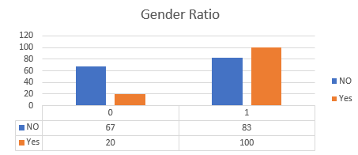

**INSIGHT:** The Male gender is at high risk of being a victim of heart disease. From the visual above ( 0 = Female, 1 = Male)

## PROBLEM QUESTION: Which features are most important in determining the presence/absence of heart disease? 

To identify the variable that has the strongest relationship with heart disease, regression is employed. The analyses use **R square** value from the Regression statistics and 3 values (**F, coefficient, and P-Value**) from the ANOVA results to arrive at a conclusion. 
**R square:** 	Tells how much impact a variable has on the predictive entity.
**F statistics:**	Captures the joint significance of the independent variable. So, the higher this value 
		The better the model.
**Coefficient:**	The coefficient value in this analysis is used to determine the relationship direction
**P-value:**		This is also known as the probability value, the lower the probability value the better the model, before any p-value is taken for consideration in this analysis it must be 	<= 0.005/0.001. 

### CASE 1: AGE VS HEART DISEASE 
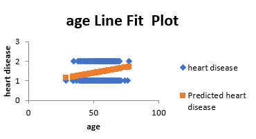

**R square** = 0.05			**Coefficient** = 0.01 	**F statistics** = 12.65

**DEDUCTION:** The age factor has less impact on the presence of Heart Disease though its directly proportional to heart diseases rate. R square value validate its 5% contribution to the presence of heart disease, the low F statistics value gives the impression the age feature can’t be relied on as a predicting value. 

### CASE 2:  Major Vessel vs Heart Disease 
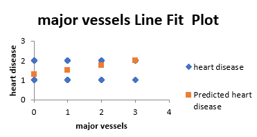

**R square** = 0.21		**Coefficient** = 0.24 	**F statistics** = 70.10

**DEDUCTION:** The Major vessel factor has an impact on the presence of heart disease. It has a direct relationship to heart disease. R square value validates its 21% contribution to the presence of heart disease, high F statistics value shows this feature can be used in predicting heart disease. 

### CASE 3: ST segment 
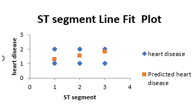

**R square** = 0.11		**Coefficient** = 0.27 	**F statistics** = 34.8

**DEDUCTION:** The ST segment factor also contributes 11% to the presence of heart disease and the F statistics value is within a range that can’t be overlooked. Therefore, the ST segment has an impact on the presence of heart failure.

### CASE 4: OLD PEAK VS HEART DISEASE
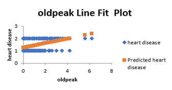

**R square** = 0.17 	**Coefficient** = 0.18 	**F statistics** = 56.73

**DEDUCTION:** The Old Peak factor also contributes 17% to the presence of heart disease, F statistics value proof old peak value can be depended on in predicting heart disease. 

### CASE 5: EXERCISE-INDUCED ANGINA VS. HEART DISEASE
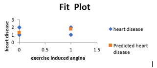

**R square** = 0.18		**Coefficient** = 0.44 	**F statistics** = 57.17

**DEDUCTION:** The exercise-induced angina factor also contributes 18% to the presence of heart disease, F statistics value proof exercise-induced angina value can be depended on in predicting heart disease. 

### CASE 6: MAX HEART RATE VS HEART DISEASE
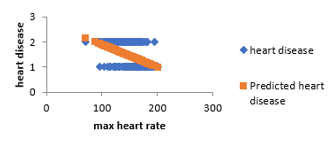

**R square** = 0.18		**Coefficient** = -0.01	**F statistics** = 56.91

**DEDUCTION:** The max heart rate factor also contributes 18% to the presence of heart disease, F statistics value proof heart rate value can be depended on in predicting heart disease. However, the max heart rate has an inverse relationship with heart disease. 

### CASE 7: RESTING ELECTROCARDIOGRAPHIC VS. HEART DISEASE
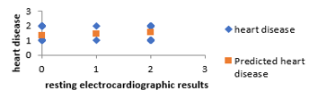

**R square** = 0.03		**Coefficient** = 0.09	**F statistics** = 9.19

**DEDUCTION:** Resting electrocardiographic has an insignificant impact on the presence of heart failure from the determining values. 

### CASE 8: FASTING BLOOD SUGAR VS HEART DISEASE

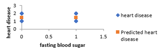

**R square** =	0.00027	**Coefficient** = - 0.02	**F statistics** = 0.07

**DEDUCTION:** Fasting blood sugar have no relationship with heart disease.

### CASE 9: SERUM CHOLESTROL VS HEART DISEASE

 **R square** = 0.01		**Coefficient** = 0.001	**F statistics** = 3.79
 
**DEDUCTION:** Serum cholesterol have no relationship with heart disease. 

### CASE 10: CHEST PAIN TYPE VS HEART DISEASE

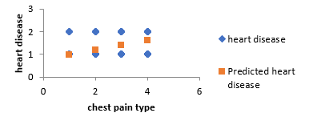

**R square** = 0.17		**Coefficient** = 0.22	**F statistics** = 56.55

**DEDUCTION:** Chest pain type has direct relationship with heart disease and its contributing 17% of the heart disease. 

### CASE 11: THAL VS HEART DISEASE
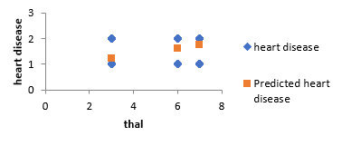

**R square** = 0.28		**Coefficient** = 0.13	**F statistics** = 101.99

**DEDUCTION:** Thal has 28% contribution to presence of heart disease and with highest F statistics vale which made it a reliable feature in predicting  presence of heart disease. 

## CONCLUSION 
Through rigorous statistical analysis, this project sheds light on the factors influencing heart failure, offering valuable insight to both medical practitioners and researchers 

**FACTORS** 	                   |	**DEPENDECY**
:------------------------------: | :------------------------------:
Thal	 		                       |	Very High
Major vessel		                 |	Very High
Old Peak		                     |	High
Exercise Induced Agina	         |	High
Max Heart Rate 	                 |	High
ST segment 		                   |	Average

